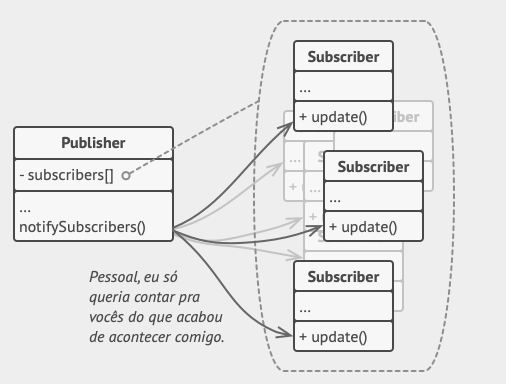

# Padrão Observer

O Observer é um padrão de projeto comportamental que permite que você defina um mecanismo de assinatura para notificar
múltiplos objetos sobre quaisquer eventos que aconteçam com o objeto que eles estão
observando. [Link](https://refactoring.guru/pt-br/design-patterns/observer)

Bibliografia: https://refactoring.guru/pt-br/design-patterns/observer

# Project Reactor

Reactor Core é uma biblioteca do Java 8 que implementa o modelo de programação reativa com base na especificação da
*Reactive Stream Specification* que é a especificação para processamento de Streams de maneira assíncrona.

Paradigma de programação baseado em eventos que podem ser aguardados em diferentes pontos do código servindo como
gatilhos para execução de lógicas específicas.

Baseia-se na utilização em fluxos assíncronos de dados e na propagação de mudanças nesse fluxo.

    <dependency>
        <groupId>io.projectreactor</groupId>
        <artifactId>reactor-core</artifactId>
        <version>3.4.17</version>
    </dependency>

## Subscriber

> org.reactivestreams.Subscriber

### Métodos

* onNext — Método executado para notificar ao objeto observable sobre um novo dado no fluxo deste objeto.
* onCompleted — Notifica que não ha mais nenhum dado a ser consumido.
* onError — Utilizado para notificar que houve um erro ocorreu no processamento dos dados
* onSubscriber — Utilizado logo após o observable ser adicionado a um publicador. Este método possui como parâmetro um
  objeto do tipo Subscription, sendo este responsável, através do método request, informar o quanto o subscriber pode
  receber dados (onNext). Este é uma característica do Streams denominada backpressure.

[Exemplo](../reactor/src/main/java/br/com/letscode/reactor/subscriber/SimpleSubscriber.java)

## Publisher

> org.reactivestreams.Publisher

* subscribe — Adiciona um subscriber para receber uma notificação quando um evento ocorrer.

### Fluxos

Para uma aplicação ser reativa ela deve reagir de acordo com um fluxo de dados.

Iremos trabalhar aqui com dois tipos:

* Flux
    * Fluxo de 0...n elementos, podendo ter um número indefinido de elementos.
* Mono
    * Fluxo de 0...1 elemento

Ambas implementam reactor.core.publisher.Publisher

Pode fazer sentido utilizar Mono quando você sabe que o fluxo resultante pode levar a no máximo 1 elemento, como um
findOne por exemplo.

O fluxo só irá começar a fluir depois que associamos um subscribe a ele

[Exemplo](../reactor/src/main/java/br/com/letscode/reactor/exemplos/FluxoSimples.java)

Adicionando nosso subscriber.

[Exemplo](../reactor/src/main/java/br/com/letscode/reactor/exemplos/FluxoNovoSubscriber.java)

## Backpressure

> Backpressure or the ability for the consumer to signal the producer that the rate of emission is too high

- [Reactor Reference](https://projectreactor.io/docs/core/3.4.6/reference/index.html)

Temos o controle e avisamos para o nosso produtor qual é a nossa taxa de consumo e só continuamos a consumir após
estarmos pronto para mais dados.

Podemos pensar na implementação de uma newsletter. Uma pessoa irá escrever uma série de artigos de uma vez, sendo que o
envio para os usuários deve ocorrer uma vez por dia. Então utilizamos o backpressure para segurar o que já foi feito
para ser processado em outro momento.

[Exemplo](../reactor/src/main/java/br/com/letscode/reactor/exemplos/Backpressure.java)
[Subscriber](../reactor/src/main/java/br/com/letscode/reactor/subscriber/BackpressureSubscriber.java)

## Transformar dados

Assim como no Streams o *Reactive Stream* também possui o método **map** que serve para realizar transformação de dados.

[Exemplo](../reactor/src/main/java/br/com/letscode/reactor/exemplos/FluxMap.java)

## Combinando Streams

É possível também combinar mais fluxos em um mesmo subscriber

[Exemplo](../reactor/src/main/java/br/com/letscode/reactor/exemplos/CombinandoFluxos.java)

## Fluxo infinito

Até agora só vimos casos aonde o fluxo de dados é limitado a um número n de elementos. Porém, esse fluxo pode durar
indefinidamente. Uma das formas de criar um fluxo infinito é criando um *ConnectableFlux*. Ele consegue simular um fluxo
infinito de dados.

Nesse caso o fluxo só começa a rodar quando nos conectamos a ele.

Um caso de uso aonde podemos aplicar o fluxo indeterminado seria, por exemplo, tratando geolocalização, aonde o fluxo de
informação seria contínuo.

[Exemplo](../reactor/src/main/java/br/com/letscode/reactor/exemplos/FluxoIndeterminado.java)

## Paralelismo

Se observarmos pelos logs, todas as operações ocorreram na mesma thread, a Main.

É possível executar as operações em uma thread diferente. A thread que chamou o método continua executando enquanto que
as operações do Stream são executadas em outra thread.

[Exemplo](../reactor/src/main/java/br/com/letscode/reactor/exemplos/Paralelismo.java)

Material extra: https://www.vinsguru.com/reactor-parallel-flux/

## Publisher

> org.reactivestreams.Processor

Atua tanto como processor tanto como subscriber

# Referencia externa

Fonte: https://medium.com/@marcelomg21/reactive-programming-project-reactor-spring-webflux-em-uma-arquitetura-de-micro-servi%C3%A7os-e4351028ff9a

Spring: Project Reactor — Core e Fluxos Funcionais

Project Reactor trata-se de uma Library, sendo a mais popular/moderna implementação da Reative Stream Specification.
Atualmente, fazendo parte do ecossistema Spring possuindo seu foco primário em legibilidade de código sem sacrificar a
performance, encorajando a composição de Workflows (fluxos de trabalho) através da cadeia de operadores em pipelines
funcionais.

Desta forma, nada acontece até que um Subscriber crie uma Subscription, que irá dispará o fluxo de dados (métodos como
.block() ou .subscriber() podem disparar uma inscrição por parte do Subscriber), assim a comunicação por parte da
Subscription é realizada entre Subscriber e Publisher (upstream) e adicionalmente, do Publisher para Subscriber (
downstream).

Eventos estão em toda parte e são processados pelos Dispatchers, podendo ser síncronos ou assíncronos dependendo do tipo
de implementação. Reactor 1.x possui habilidade para processamento de eventos em alta velocidade, assíncronos e não
bloqueantes, integrando-se bem com Spring Framework e Netty.

Reactor 1.x não possui suporte a estratégias de Backpressure, bloqueando o Publisher e necessitando fazer Pulling de
eventos. Reactor 3.x pode ser usado somente com Java 8+, liderando a base reativa existente no Spring Framework.

Reactor é agnóstico a concorrência, oferecendo Schedulers para processamento em paralelo do fluxo de dados no pipeline.
No Project Reactor, as classes Flux e Mono são duas implementações da interface Publisher presente na Reactive Stream
Specification. Containers de dados infinitos são naturais no estilo de programação reativa, nesse caso, os Subscribers
podem cancelar a inscrição a qualquer momento, tornando o fluxo finito.

Dentro do fluxo de processamento do Pipeline, cada Operator dentro do fluxo de dados gera um novo Stream com base no
Stream de entrada. Mono possui semântica semelhante ao CompletableFuture e pode ser utilizado em seu lugar.
CompletableFuture não pode completar uma execução sem emitir um valor, iniciando o processamento imediatamente sem
disparo de assinatura. Flux e Mono possuem diversos métodos (Operators) para criarmos Streams com base nos dados
disponíveis, consumindo elementos produzidos por uma cadeia de Streams reativos.

Ao desenvolvermos nossos fluxos de dados reativos, Steps de transformação estão por toda a parte. Implementados pelos
Processors (operadores), e desta forma, o mapeamento de eventos dentro de sequências reativas trata-se da forma mais
natural de transformação de dados dentro do fluxo. Alguns operadores possuem maior índice de uso, popularidade e
utilidade.

Quando se trata da implementação em Streams reativos, operadores como .map(), .flatMap(), .concatMap(),
.flatMapSequential(), etc possuem alto índice de uso. O operador .map(Function<T, R>) mapeia e transforma cada elemento
presente no Source para um novo elemento no Target, criando o elemento no destino e alterando seu tipo de T para R
conforme assinatura do Operator (operador).

Tanto Flux quanto Mono provêm os operadores citados, possuindo comportamentos semelhantes do ponto de vista de
implementação. O operador .map() pode ser utilizado tanto dentro de um Flux como de um Mono, gerando respectivamente
transformações tanto de Flux<T> para Flux<R>, quanto de Mono<T> para Mono<R>. Neste contexto, Mono representa um Stream
contendo um único sinal. Por outro lado, Flux é representado por um Stream contendo mais de um sinal emitido no Source.

No caso de necessitarmos de concatenação em nosso Pipeline, o operador .concat() concatena todos os elementos emitidos a
partir dos canais Upstream(source) de entrada, somente iniciando a concatenação dos elementos subsequentes no Stream
após a finalização do elemento anterior e assim por diante.

O operador .merge(), por outro lado, mistura os dados presentes nos Stream de entrada (Upstream) para o Stream de
saída (Downstream). Diferente do operador .concat(), a inscrição (Subscriber) aos Upstreams Sources é realizada de forma
imediata, simultaneamente, em todos os canais, não aguardando o processamento elemento a elemento como ocorre no
operador .map().

O operador .zip() inscreve-se em todos os Upstreams de entrada, aguarda todos os elementos pertencentes ao Source Stream
emitirem seus sinais para então combinar todos eles em um único elemento de saída (Output Stream). No Reactor, o
operador .zip() pode operar não somente em Publishers reativos (Flux e Mono) mas também em objetos Iterable,
disponibilizando para este propósito o operador .zipWithIterable().

O operador .flatMap(Function<T, Publisher<R>>) possui papel fundamental e crucial não somente no contexto reativo mas
primeiramente no universo funcional. O .flatMap() trata-se de um dos operadores mais complexos de entender, porém, uma
vez que realmente compreendemos como ele funciona, este operador acaba tornando-se uma poderosa ferramenta para auxiliar
na construção de fluxos reativos.

Naturalmente, o Project Reactor não poderia deixar de oferecer uma implementação deste operador, bem como algumas
variações como .flatMapSequential(). O operador .flatMap() consiste logicamente em duas operações executadas em
conjunto: .map() e .merge().

Portando antes de entendermos o comportamento do .flatMap(), é necessário entender o operador .merge(). Dentro do
.flatMap(), a etapa de .map(), transforma cada elemento de entrada em um Stream reativo de saída com ciclo de vida
próprio. O .merge() por sua vez realiza a combinação dinâmica de de todas as sequências de Stream geradas em uma nova
sequência (Stream) reativa, através do qual são passados elementos do tipo R transformados.

O comportamento interno dos operadores .flatMap() e .flatMapSequential() em relação aos Substreams gerados é
inscrever-se instantaneamente e simultaneamente nestes novos Streams, passando a reagir aos eventos emitidos. O
comportamento de inscrição instantânea do .flatMap() difere-se de operadores como .concatMap(), neste caso
comportando-se de maneira oposta e somente inscrevendo-se no próximo Substream após o término (.onComplete() —
onError()) do Stream antecedente.

Importante observar que o operador .concatMap() preserva a ordem dos elementos de origem por conta de sua natureza
sequencial. Por outro lado, o operador .flatMap() não necessariamente preserva a ordem original por utilizar
internamente o operador .merge(), intercalando os elementos dinamicamente. A saída, visando obter vantagens entre o
melhor dos mundos, seria utilizar o operador .flatMapSequential(), preservando a ordem dos elementos originais e
realizando o controle de ordenação por meio de uma Queue (fila) interna.

O principal caso de uso para o operador .flatMap() seria efetuar chamadas assíncronas não bloqueantes com promessa de
retorno (Callback) via Promise (promessa). Assim, o retorno da chamada seria garantido em algum momento desconhecido no
tempo, tendo seu retorno processado efetivamente em diferentes Threads de forma assíncrona, possibilitando o retorno ao
fluxo principal do Pipeline a partir do Step ao qual a chamada ao .flatMap() foi realizada.

# Bibliografia:

* https://medium.com/@marcelomg21/reactive-programming-project-reactor-spring-webflux-em-uma-arquitetura-de-micro-servi%C3%A7os-e4351028ff9a
* https://www.baeldung.com/reactor-core
* https://www.vinsguru.com/reactor-parallel-flux/

