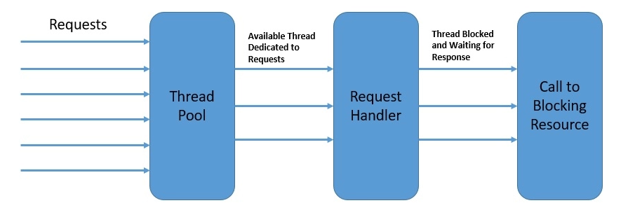
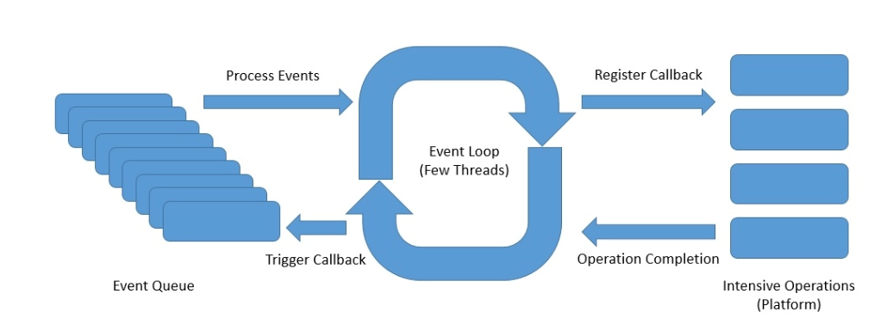
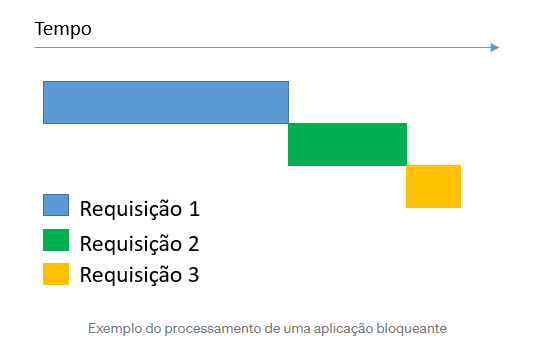
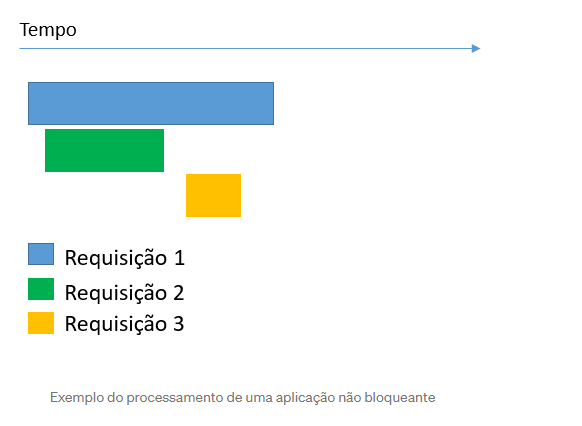

# Programação reativa

Uma aplicação web padrão vai disparar uma thread para cada request. Ela vai buscar no buffer de Threads, pegar uma
thread disponível e ocupar ela até que a requisição seja retornada.

No caso da programação reativa temos um buffer menor de Threads e cada etapa ocorre de maneira assíncrona, sendo que
caso encontre algo bloqueante ela cadastra um subscriber e devolve essa thread para outra operação ser realizada. Quando
esse subscriber terminar ele vai voltar em uma thread livre e vai continuar o processamento.

Assim todo nosso fluxo independe agora de ter ou não muitas threads disponíveis e para de focar em qual thread a
execução foi chamada e sim com o enfoque no processamento assíncrono.

* The event loop runs continuously in a single thread, although we can have as many event loops as the number of
  available cores
* The event loop process the events from an event queue sequentially and returns immediately after registering the
  callback with the platform
* The platform can trigger the completion of an operation like a database call or an external service invocation
* The event loop can trigger the callback on the operation completion notification and send back the result to the
  original caller

Simplificando para um melhor entendimento. No caso de haver apenas uma Thread atendendo os requests temos abaixo.

Já no caso do assíncrono teríamos algo assim.

Bibliografia: https://www.baeldung.com/spring-webflux-concurrency

# WebFlux

É um módulo do spring que veio para possibilitar aplicações *Web* trabalharem de forma reativa.

Além disso, não necessitamos do Servlet API para rodarmos uma aplicação WebFlux, substituindo-os por Reactive Streams /
HTTP, nem do Tomcat Servlet Container ao utilizarmos Netty Server.

O Netty é uma estrutura de servidor que oferece a infraestrutura não bloqueante e trabalha com tempo de execução
assíncrono. Por isso é o mais coerente de ser utilizado quando se trabalha com programação reativa.

O módulo WebFlux utiliza o design existente do Web MVC, aplicando mudanças mínimas de código e potencialmente
reutilizando boa parte. Utilizando WebFlux, garantimos um modelo de design reativo em direção a um módulo Web Stack,
oferecendo uma experiência realmente reativa.

## Dependência

Dependência para o webflux

    <dependency>
        <groupId>org.springframework.boot</groupId>
        <artifactId>spring-boot-starter-webflux</artifactId>
    </dependency>

Dependência para o reactive mongo

# Exemplo

## Server com Mongo

Vamos utilizar o mongo reativo nos nossos exemplos. O JPA ainda não dá suporte a aplicações reativas.

### Config

Para isso é necessário incluir a dependência no POM.

    <dependency>
        <groupId>org.springframework.boot</groupId>
        <artifactId>spring-boot-starter-data-mongodb-reactive</artifactId>
    </dependency>

Depois basta adicionar a anotação abaixo e adicionar as propriedades
no [properties](../server/src/main/resources/application.properties)

> @EnableReactiveMongoRepositories

### Documento

Antes tínhamos declarado Pessoa como uma entidade. Agora vamos transformar ela em um documento.

[Exemplo](../server/src/main/java/br/com/letscode/webflux/server/model/Pessoa.java)

### Repository

Vamos alterar o nosso repository para conseguir fazer consultas reativas.

[Exemplo](../server/src/main/java/br/com/letscode/webflux/server/repository/PessoaRepository.java)

### Service

No nosso service, no lugar das listas iremos devolver um Flux e nos objetos um Mono.

[Exemplo](../server/src/main/java/br/com/letscode/webflux/server/service/PessoaService.java)

### Controller

Nosso controller agora deverá devolver os dados de forma reativa.

[Exemplo](../server/src/main/java/br/com/letscode/webflux/server/controller/PessoaController.java)

### Execução

Vamos criar uma imagem docker da aplicação de modo simplificado. Sem utilizar o dockerfile.

> mvn spring-boot:build-image -Dspring-boot.build-image.imageName=letscode/flux-server

Nossa aplicação depende do mongo. Nesse caso optamos por criar um docker compose para subir tanto o mongo quanto a
aplicação.

No caso do mongo já rodando basta utilizar o comando abaixo

> docker run -p 8381:8381 -t letscode/flux-server:0.0.1-SNAPSHOT

### Router e Handler

Há outra opção que não utiliza as anotações @RequestMapping e @Controller. É o caso da RouterFunction.

O Handler é onde manipula-se as requisições e defini-se os retornos como retorno HTTP, Content-Type e Body da resposta.

[Exemplo](../server/src/main/java/br/com/letscode/webflux/server/handler/PessoaHandler.java)

O Router é o componente onde defini-se as rotas através de funções, recebendo como argumento do método o Handler já
pré-definido para especificar o retorno para cada rota criada.

[Exemplo](../server/src/main/java/br/com/letscode/webflux/server/router/PessoaRouter.java)

https://www.educative.io/blog/spring-webflux-tutorial

https://medium.com/@michellibrito/spring-webflux-f611c8256c53

## Client

Para utilizarmos o cliente do webflux vamos utilizar o **WebClient**

Primeiro vamos criar o WebClient com uma baseUrl que vai ser padrão para todos os nossos métodos.

    private final WebClient webClient;

    public SimpleProcess() {
        this.webClient = WebClient.builder()
                .baseUrl("http://localhost:8381")
                .build();
    }

Podemos utilizar o **mutate()** se quisermos alterar uma configuração prévia do WebClient.

* Com o webclient escolhemos qual método de request ele vai utilizar, no nosso exemplo temos o get.
* Escolhemos agora qual será o endpoint acessado
* Passamos quais são nosso headers
* Solicitamos que ele vá buscar a informação
* Transformamos a nossa resposta em um fluxo de uma classe que conhecemos
* Inscrevemos o nosso subscriber e fazemos nosso processamento

        webClient.get()
                .uri("pessoa")
                .header(HttpHeaders.CONTENT_TYPE, MediaType.APPLICATION_JSON_VALUE)
                .retrieve()
                .bodyToFlux(Pessoa.class)
                .log()
                .subscribe(new SimplePessoaSubscriber());

Para praticar, crie um subscriber que realize algum processamento e utilize também o Backpressure para regular o fluxo
de mensagens consumidas.

[Exercício](../Client/src/main/java/br/com/letscode/client/webflux/subscriber/BackpressureSubscriber.java)

# Bibliografia

* https://medium.com/@marcelomg21/reactive-programming-project-reactor-spring-webflux-em-uma-arquitetura-de-micro-servi%C3%A7os-e4351028ff9a
* https://medium.com/nstech/programa%C3%A7%C3%A3o-reativa-com-spring-boot-webflux-e-mongodb-chega-de-sofrer-f92fb64517c3
* https://www.baeldung.com/spring-webflux
* https://www.educative.io/blog/spring-webflux-tutorial
* https://medium.com/@michellibrito/spring-webflux-f611c8256c53
* https://www.baeldung.com/spring-webflux-concurrency
